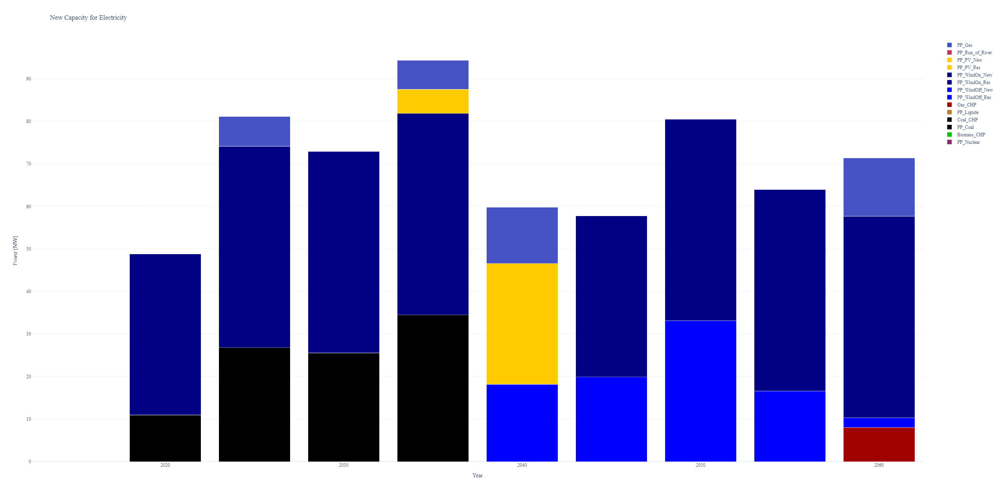

<p align="center">
  
</p>

# Compact Energy System Modeling Tool (CESM)
This is a compact energy system modeling tool that can model different forms of energy carriers and the conversion processes that convert them to each other. 
The optimal output of the model determines how much should be invested in each part of the energy system to meet the energy demand and minimize costs.

An example of the German energy system is also provided. The results of the model are compatible with the results of the paper "Barbosa, Julia, Christopher Ripp, and Florian Steinke. Accessible Modeling of the German Energy Transition: An Open, Compact, and Validated Model. Energies 14, no. 23 (2021)"



## Installation
1. Download and install the following software from their official websites:
   - Python (version 3.10 or above)
   - Gurobi

2. Set up a virtual environment:
   ```console
   > python -m venv env
   > env\Scripts\activate

3. Install CESM package:
	```console
	> pip install --upgrade cesm
	```


4. Initialize the data files structure:
	```console
	> cesm init
	```
## Quick Start
Run the available models located in the Data folder using the following command:
	```console
	> cesm run
	```

After the run is finished, plot the results with the following command:
	```console
	> cesm plot
	```
These steps will help you quickly set up and start using the Compact Energy System Modelling Tool (CESM).

## Documentation
You can find our documentation [online](https://cesm.readthedocs.io/en/latest/)
or build it yourself:

1. Install documentation requirements:
	```console 
	> pip install -r docs\requirements.txt
	```
2. Make build documentation:
	```console
	> docs\make html
	```

Then you can open the documentation from *docs/build/html/index.html*.


## Authors
- [Julia Barbosa](https://github.com/JP-Barbosa)
- [Sina Hajikazemi](https://github.com/SinaHKazemi)

## Roadmap
- [ ] Tests
- [ ] Design simple examples
- [ ] Saving the results
- [ ] Postprocessing code
- [ ] Implementing the model in other libraries(Pyomo, AMPL, ...)


## Citation
If you use this software in your research, please cite this repository.
If you use the German energy transition model in your research, please cite the original paper:

    Barbosa, J.; Ripp, C.; Steinke, F. Accessible Modeling of the German Energy Transition: An Open, Compact, and Validated Model. Energies 2021, 14, 8084. https://doi.org/10.3390/en14238084

For Bibtex you can use the following:

	@Article{en14238084,
	AUTHOR = {Barbosa, Julia and Ripp, Christopher and Steinke, Florian},
	TITLE = {Accessible Modeling of the German Energy Transition: An Open, Compact, and Validated Model},
	JOURNAL = {Energies},
	VOLUME = {14},
	YEAR = {2021},
	NUMBER = {23},
	ARTICLE-NUMBER = {8084},
	URL = {https://www.mdpi.com/1996-1073/14/23/8084},
	ISSN = {1996-1073},
	ABSTRACT = {We present an easily accessible model for dispatch and expansion planning of the German multi-modal energy system from today until 2050. The model can be used with low efforts while comparing favorably with historic data and other studies of future developments. More specifically, the model is based on a linear programming partial equilibrium framework and uses a compact set of technologies to ease the comprehension for new modelers. It contains all equations and parameters needed, with the data sources and model assumptions documented in detail. All code and data are openly accessible and usable. The model can reproduce today&rsquo;s energy mix and its CO2 emissions with deviations below 10%. The generated energy transition path, for an 80% CO2 reduction scenario until 2050, is consistent with leading studies on this topic. Our work thus summarizes the key insights of previous works and can serve as a validated and ready-to-use platform for other modelers to examine additional hypotheses.},
	DOI = {10.3390/en14238084}
	}

## License
The project is licensed under the MIT license - see the [LICENSE.md](LICENSE.md) file for details.

